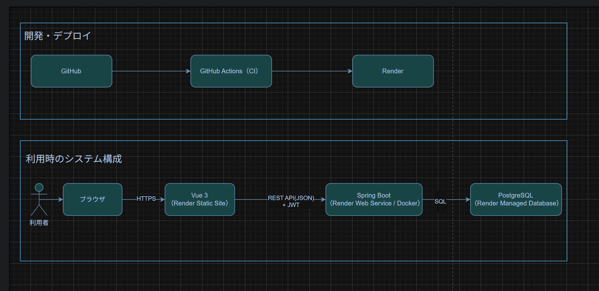
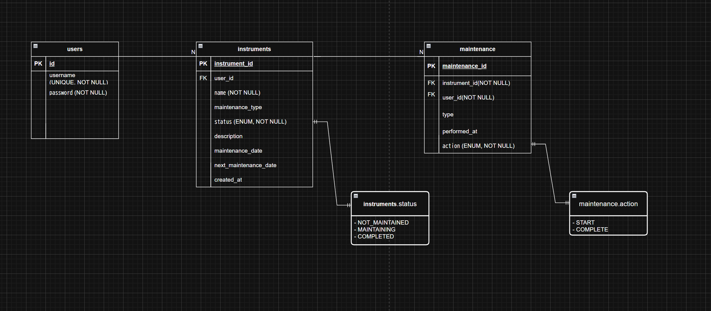

# Instrument Maintenance Management App

音楽機材（ギター・ピアノ等）のメンテナンス業務を管理する  
SPA + REST API構成のWebアプリケーションです。

---

## アプリケーションURL

https://instrumentmaintenancemanageapp.onrender.com/

テスト用アカウント  
ユーザー名: test111  
パスワード: 111

---

## デモ動画（メンテナンス履歴管理）

機材のメンテナンス開始・完了を記録し、履歴として管理する機能のデモです。

動画はこちら
https://raw.githubusercontent.com/masaki-dream/InstrumentMaintenanceManageApp/main/docs/demo.mp4

---

# 開発背景

私はアコースティックギターを5年間、ピアノを数ヶ月演奏してきました。

しかし、

- いつ弦交換をしたのか
- いつ掃除をしたのか

を記録しておらず、管理が曖昧になっていることに不満を感じました。

この経験から、  
「音楽機材メンテナンス管理アプリ」を開発しました。

---

# このアプリでアピールしているポイント

### ✅ RESTful API設計
- 名詞ベースのリソース設計
- HTTPメソッドの適切な使い分け
- ステータスコード設計の明確化

---

### ✅ 業務状態遷移をAPIで表現
単純なCRUDではなく、業務イベントをAPIとして設計。

#### 状態遷移API

| 操作 | メソッド | エンドポイント | 状態遷移 |
|---|---|---|---|
| メンテナンス開始 | POST | `/api/instruments/{id}/maintenances/start` | 未メンテナンス → メンテナンス中 |
| メンテナンス完了 | POST | `/api/instruments/{id}/maintenances/complete` | メンテナンス中 → メンテナンス完了 |

状態を直接更新するのではなく、  
「開始」「完了」という業務イベントとして表現。

### ✅ 冪等性を意識した設計
- 既にメンテナンス中の場合は状態を変更しない
- 409 Conflictで業務違反を明示

### ✅ 例外の共通ハンドリング
- `@ControllerAdvice` による統一エラーレスポンス
- 業務例外とシステム例外を分離

### ✅ JWTによるステートレス認証
- Bearerトークン方式
- セッション非依存設計

### ✅ CI導入
- GitHub Actionsによる自動ビルド
- mainブランチはCI成功時のみマージ可能

---

# アーキテクチャ

## システム構成図

- フロントエンドは Vue 3 を使用し、Render の Static Site としてデプロイしています。
- バックエンドは Spring Boot を Docker 化し、Render の Web Service としてデプロイしています。
- フロントエンドとバックエンドは REST API で通信し、認証には JWT を使用しています。
- データベースには Render Managed PostgreSQL を利用しています。

## フロントエンド
- Vue 3（Vite）
- SPA構成
- 業務ロジックは持たない

## バックエンド
- Spring Boot
- Controller / Service / Repository のレイヤード構成
- Service層に業務ロジックを集約
- REST API専用設計（画面描画Controllerは未実装）

## データベース
- PostgreSQL 15
- ローカルはDocker
- 本番はRender Managed DB

## インフラ
- Render
- GitHub Actions（CI）

---

# ER図

本アプリでは、ユーザー・機材・メンテナンス履歴の3つのエンティティを中心にデータを管理しています。

- 1ユーザーは複数の機材を登録可能
- 1機材に対して複数のメンテナンス履歴を登録可能

---

# ドメイン設計

## 機材の状態

- NOT_MAINTAINED（未メンテナンス）
- MAINTAINING（メンテナンス中）
- COMPLETED（メンテナンス終了）

## 状態遷移

NOT_MAINTAINED  
↓ start  
MAINTAINING  
↓ complete  
COMPLETED  

メンテナンスは履歴として保持し、  
1つの機材に対して複数回実施可能。

---

# API一覧

| 機能 | メソッド | エンドポイント |
|------|----------|----------------|
| ユーザー登録 | POST | /api/users |
| ログイン | POST | /api/auth/login |
| 機材一覧取得 | GET | /api/instruments |
| 機材詳細取得 | GET | /api/instruments/{id} |
| 機材登録 | POST | /api/instruments |
| 機材更新 | PUT | /api/instruments/{id} |
| 機材削除 | DELETE | /api/instruments/{id} |
| メンテナンス開始 | POST | /api/instruments/{id}/maintenances/start |
| メンテナンス完了 | POST | /api/instruments/{id}/maintenances/complete |

---

# 認証
Authorization: Bearer <JWT>

---

# 技術スタック

- Vue 3
- Spring Boot
- PostgreSQL
- Docker
- Render
- JWT
- GitHub Actions

---

# 今後の改善予定

- 問い合わせフォームの実装
- 楽器詳細画面のメンテナンス履歴を「1ヶ月毎」や「1年毎」で管理する機能の実装
- バグ改修・継続的改善
- テストコードの拡充
